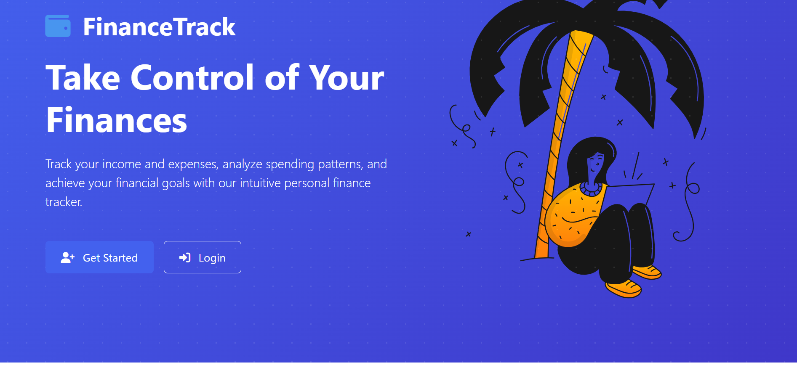
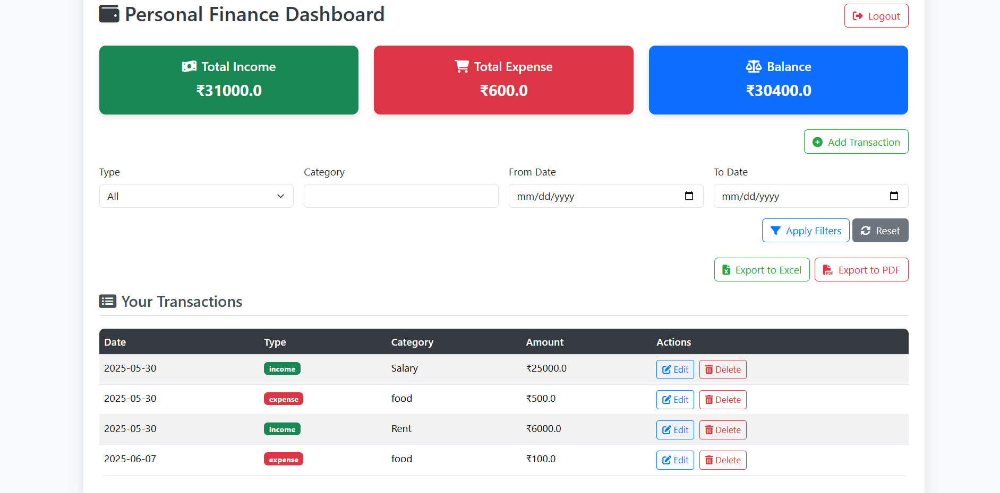
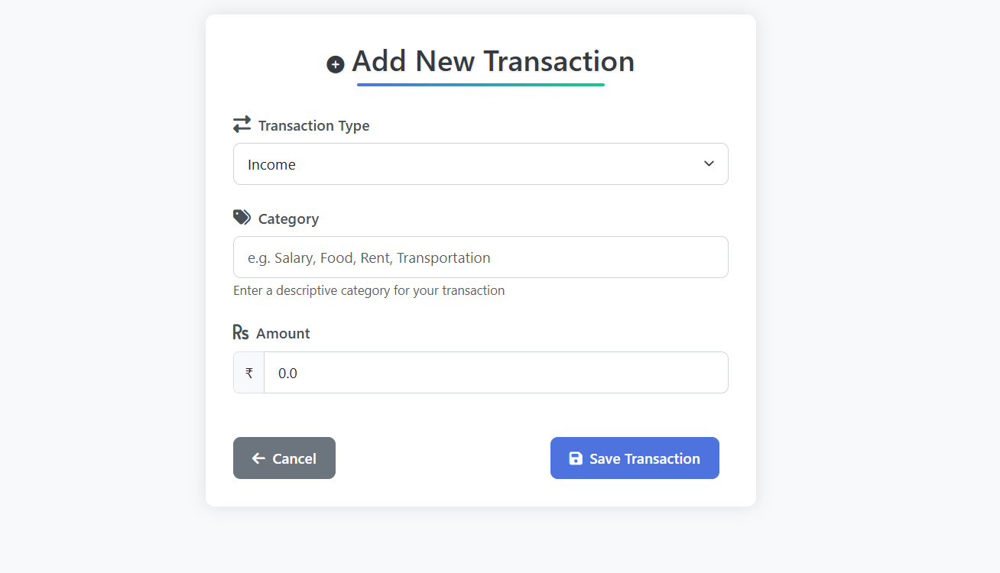
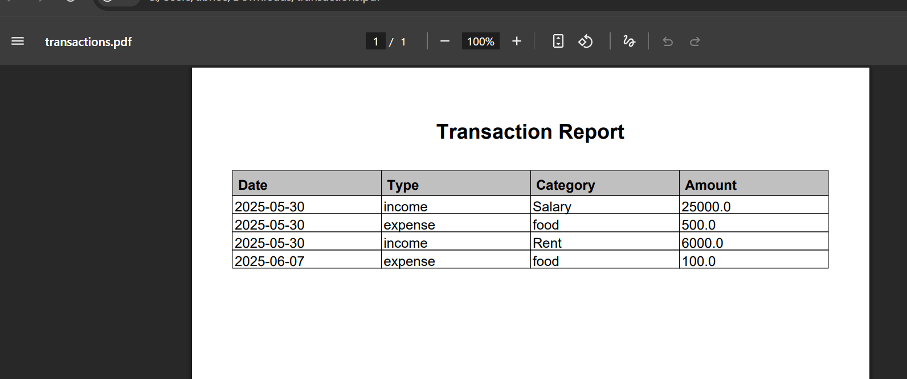
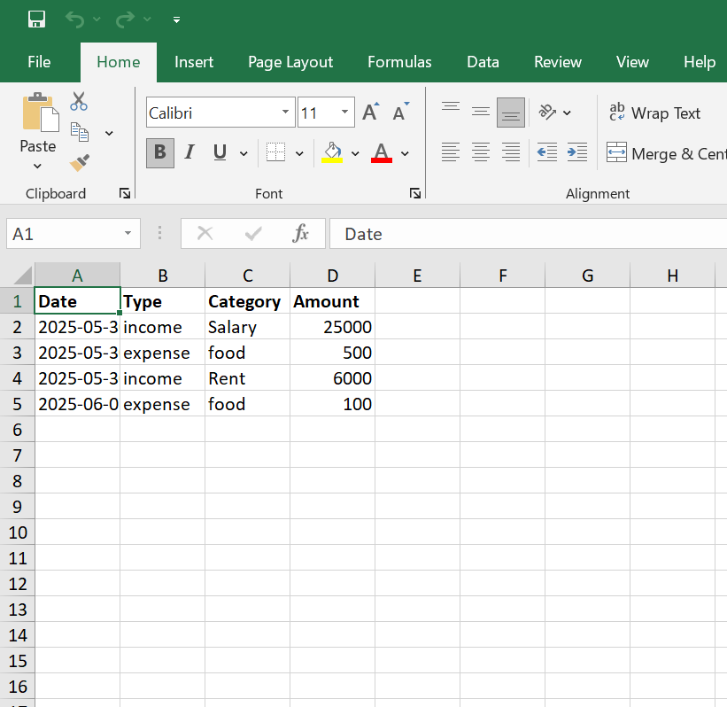

# 💰 Personal Finance Tracker

A web-based full-stack application built using **Spring Boot**, **Thymeleaf**, and **MySQL**, designed to help users track and manage their income and expenses efficiently. This project demonstrates skills in backend development, MVC architecture, database integration, and dynamic filtering on the frontend.

---

## 🔍 Project Overview

The Personal Finance Tracker allows users to:

- **Register/Login** securely.
- **Add, edit, and delete** income and expense transactions.
- **View financial summaries** on a dashboard.
- **Filter transactions** by **date range, category**, and **type (income/expense)**.
- Export the Transaction History either in **PDF format** or **Excel Sheet**.

---

## 🛠️ Technologies Used

| Layer        | Technology Used                           |
|--------------|--------------------------------------------|
| Backend      | Java, Spring Boot, Spring MVC, Spring Data JPA |
| Frontend     | Thymeleaf, HTML5, Bootstrap 5, CSS         |
| Database     | MySQL                                      |
| Tools        | Maven, Git, GitHub, VS Code / IntelliJ     |
| Security     | Spring Security (for authentication)       |

---

## ✨ Key Features

- 🔐 **User Authentication** – Secure login and registration flow with email uniqueness validation.
- 💸 **Transaction Management** – CRUD operations for income and expense entries.
- 📅 **Smart Filtering** – Filter transactions by:
  - Date range (Today, Last 7 Days, This Month, Custom)
  - Type (Income or Expense)
  - Category (e.g., Food, Travel, Salary, etc.)
- 📊 **Dashboard** – Overview with total income, total expenses, and current balance.

---

## 🧠 Learning Goals & Implementation

This project was developed as a part of a personal learning initiative to:

- Gain hands-on experience with **Spring Boot and MVC architecture**.
- Implement **entity relationships using JPA** (e.g., Users ↔ Transactions).
- Develop **server-side rendering using Thymeleaf**.
- Build a **modular and scalable** web application with clean separation of concerns.
- Perform real-world project hosting using GitHub for version control and collaboration.

---

## 📷 Screenshots

**1. Dashboard Overview**

**2. Dashboard Overview**

**3. Add Transaction**

**4. PDF Export**

**5. ExcelSheet Export**

---

## 🚀 Getting Started

### Prerequisites
- Java 17+
- MySQL Server
- Maven

